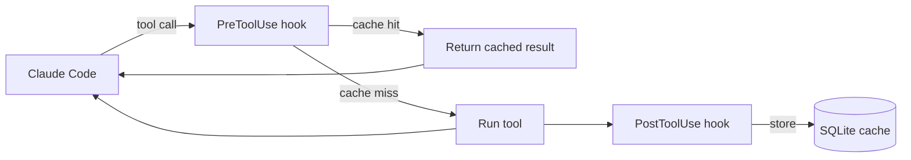

# claude-dejavu

> Your tools have been here before. Cache-first plugin for Claude Code.

[](https://www.npmjs.com/package/claude-dejavu)
[](./LICENSE)
[](https://github.com/apratico/claude-dejavu/actions)


## Cut Claude Code token usage by 30-40% in long sessions.

Claude Code re-runs the same `git log`, `ls`, `cat README.md` over
and over within a single session. Each repeated tool result floods
the context window again. **claude-dejavu** intercepts these calls,
returns cached results, and your token budget thanks you.

```bash
# Register the marketplace once
claude plugin marketplace add apratico/claude-dejavu

# Install
claude plugin install claude-dejavu@apratico
```

That's it. Zero config. Works on day one.

---

## Why claude-dejavu?

| Without dejavu | With dejavu |
|----------------|-------------|
| 47 redundant `git log` calls per session | 1 |
| 180k input tokens on a 2h refactor | ~115k |
| Hit weekly cap on Wednesday | Friday |

Real numbers from the [benchmark suite](./benchmarks). Reproduce
on your own sessions.

---

## How it works



For deterministic, read-only tool calls (`Read`, `Grep`, `Glob`,
and a safe subset of `Bash`), claude-dejavu hashes
`(tool, normalized args, mtime of relevant files)`. Cache hit
returns the stored result. Cache miss runs the tool and stores
the new result.

**Cache invalidation**
- File mtime changes → entry dropped automatically
- TTL per category (configurable)
- Explicit `/dejavu clear` slash command
- Any write operation on a file invalidates entries that read it

**Never cached**
- Write tools (Edit, Write, MultiEdit)
- Network calls (WebFetch, WebSearch)
- Bash commands with side effects (`npm install`, `git push`,
  `rm`, `curl`, ...)
- MCP tools (cache decision delegated to the MCP server)

---

## Quick start

```bash
claude plugin marketplace add apratico/claude-dejavu
claude plugin install claude-dejavu@apratico
# done
```

Slash commands:

```
/dejavu stats            # hit rate, tokens saved, cache size
/dejavu clear            # wipe everything
/dejavu clear --tool Read # wipe per tool
/dejavu why <hash>       # explain a cache decision
```

---

## Configuration

`~/.claude-dejavu/config.json` (optional):

| Option            | Default | Description                                        |
|-------------------|---------|----------------------------------------------------|
| `enabled`         | `true`  | Master switch                                      |
| `ttl.bash`        | `3600`  | TTL in seconds for Bash whitelist                  |
| `ttl.read`        | `0`     | 0 = unlimited, mtime-based invalidation            |
| `bash.allow`      | (list)  | Extra read-only Bash commands to whitelist         |
| `bash.deny`       | (list)  | Extra commands to never cache                      |
| `disabled_tools`  | `[]`    | Tool names to skip entirely                        |

---

## Benchmarks

[bar chart screenshot — 3 real session traces]

Run them yourself:

```bash
git clone https://github.com/apratico/claude-dejavu
cd claude-dejavu/benchmarks
npm install
npm run benchmark
```

---

## FAQ

**Will it cache stale results?**
No. Reads are mtime-tracked; Bash entries have a TTL; any write to
a file invalidates entries that read it.

**Does it work with MCP tools?**
Not by default. MCP servers control their own caching strategy.

**How much disk does the cache use?**
Default cap 200 MB, LRU-evicted. Configurable.

**Can I disable per-command?**
Yes — see `bash.deny` in config.

---

## Roadmap (post v0.1)
- [ ] Tool result compression (LZ4) for large outputs
- [ ] Optional shared team cache (S3 / git-backed)
- [ ] Dashboard slash command with charts
- [ ] Auto-suggest Haiku routing for simple cached tasks

## Contributing
PRs welcome. See `CONTRIBUTING.md`.

## License
MIT.
